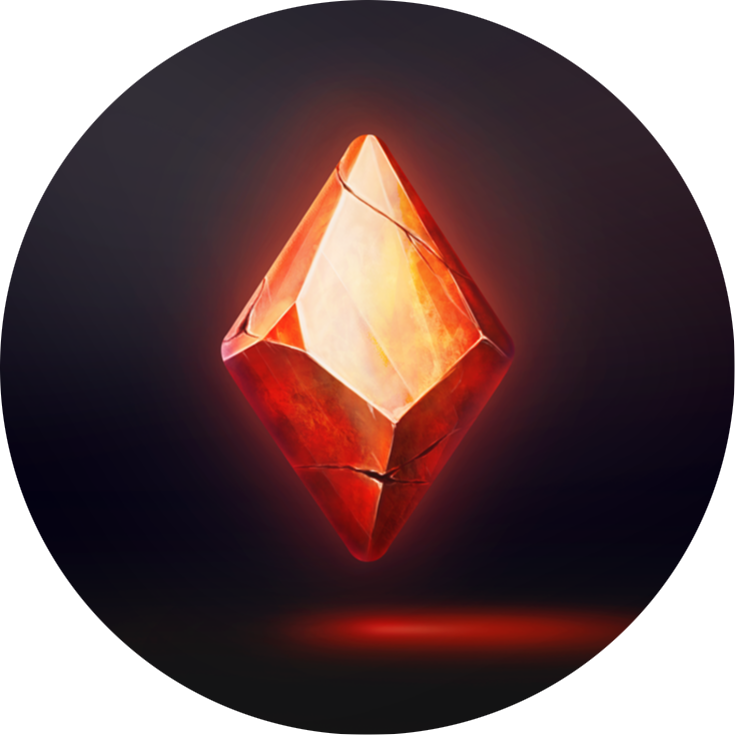

<h1 align="center" class="heading">
	
	LUANNO
</h1>

**LUANNO** is a game that runs on a Discord server via Discord bot. It's an RPG game, with goals of being played with commands only, or like D&D in voice channels, with a GM.

## Goals

(this list isn't final)

- Ability to explore and interact with a multiplayer open-world (text-based)
- Procedurally generate a world w/ live history
- Easy & full control of the world by a GM for live and quick-paced gameplay in VCs

## Non-goals

- Luanno will **NOT** have extreme level detail for level of interaction
- Luanno will **NOT** have a 1st person mode or any downloadable clients
- Luanno will **NOT** be open to multiple Discord servers. However, it is open source. Clone the project to run Luanno on your own server!

## What's the gameplay?

There isn't enough finalized mechanics to explain the gameplay, but expect a turn-based, text-based, game where you play as a character that explores through the rich procedurally generated world.

If you want to be a part of the discussion of mechanics, gameplay, and all that jazz, [join the server](#how-do-i-join)!

## How do I join?

At the moment, Luanno is a personal project of mine, for people who I know well. To play, you'll need to contact me personally: **DO NOT** open an issue or discussion on GitHub.

## I've joined, how do I play?

Currently, you can't. There's no game yet, and there won't be for some time. However, you can get started with the bot by typing `!help` in a channel, but keep in mind that at this point, your data may be deleted without second thought.

## I'm interested in development, how can I help?

For now, wait until there is more game built. You can contribute to the discussion of mechanics on the server, but core development shouldn't be attempted just yet.

## What's GitHub?

GitHub (the site you are reading this from) is a place for hosting open-source code. I use it for pretty much all of my projects, this one not being an exception. It'll be used for official development reports, feature requests, and collaborative development.

The caveat to using the tool is that you'll need a GitHub account to interact with the project, but that's free and easy to do.

---

A project by [Louis Birla](https://birla.io)
